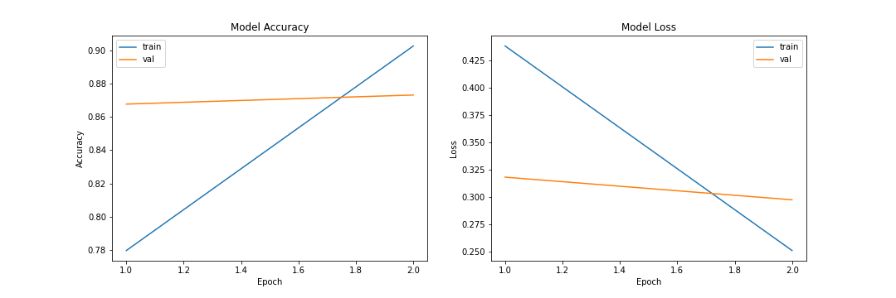

# MovieReview

Training in 2 epochs : 



#### Word Embedding 

-> Technique of natural language processing
-> Maps words or phrases to real numbers
-> Similar words that have the same meaning, have a similar representation

```
https://nlp.stanford.edu/projects/glove/
```


Convert a text into a sequence of nbs to put it into the neural network model

```python
# https://www.kaggle.com/hamishdickson/using-keras-oov-tokens
# https://www.tensorflow.org/api_docs/python/tf/keras/preprocessing/text/Tokenizer

from keras.preprocessing.text import Tokenizer

tokenizer = Tokenizer(num_words=max_features, oov_token=oov)
tokenizer.fit_on_texts(reviews["cleaned_review"])
tokenized = tokenizer.texts_to_sequences(reviews["cleaned_review"])
```

For labels : 
```python
from sklearn.preprocessing import LabelEncoder

encoder = LabelEncoder()
encoder.fit(df['review])
label_encoder = encoder.transform(df['review])
```


Split and make sure all the data are of the same X length: 
```python
# https://scikit-learn.org/stable/modules/generated/sklearn.model_selection.train_test_split.html

from keras.preprocessing import sequence
from sklearn.model_selection import train_test_split

XX = sequence.pad_sequences(tokenized, maxlen=X)
Xtrain, Xtest, ytrain, ytest = train_test_split(XX, label_encoder)
```
